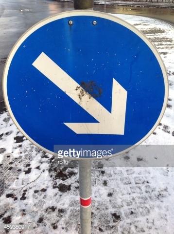
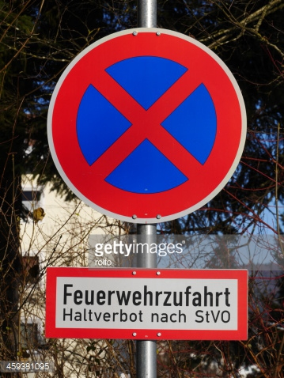

<h1>Traffic Sign Recognition</h1> 

<h2>Build a Traffic Sign Recognition Project</h2>

The goals / steps of this project are the following:
* Load the data set (see below for links to the project data set)
* Explore, summarize and visualize the data set
* Design, train and test a model architecture
* Use the model to make predictions on new images
* Analyze the softmax probabilities of the new images
* Summarize the results with a written report

[//]: # (Image References)

[image1]: ./examples/visualization.jpg "Visualization"
[image2]: ./examples/grayscale.jpg "Grayscaling"
[image3]: ./examples/random_noise.jpg "Random Noise"
[image4]: ./examples/placeholder.png "Traffic Sign 1"
[image5]: ./examples/placeholder.png "Traffic Sign 2"
[image6]: ./examples/placeholder.png "Traffic Sign 3"
[image7]: ./examples/placeholder.png "Traffic Sign 4"
[image8]: ./examples/placeholder.png "Traffic Sign 5"

<h3>Data Set Summary & Exploration</h3>

<b>1. Provide a basic summary of the data set and identify where in your code the summary was done. </b>

The code for this step is contained in the second code cell of the IPython notebook.  

I used the numpy and csv library to calculate summary statistics of the traffic
signs data set:

* The size of training set is <b>34799</b>
* The size of test set is <b>12630</b>
* The shape of a traffic sign image is <b>(32, 32, 3)</b>
* The number of unique classes/labels in the data set is <b>43</b>

<b>2. Include an exploratory visualization of the dataset and identify where the code is in your code file.</b>

The code for this step is contained in the third code cell of the IPython notebook.  

Firstly, I plotted a sample image of each class in the data set. It is a good idea to know how each traffic sign looks like, especially when we want to find sample images from the web to test our neural network:
 
For reference of the class to sign type mapping, please refer to: <a href="./signnames.csv">signnames.csv</a>

<h3>Design and Test a Model Architecture</h3>

<b>1. Describe how, and identify where in your code, you preprocessed the image data. What tecniques were chosen and why did you choose these techniques? Consider including images showing the output of each preprocessing technique. Pre-processing refers to techniques such as converting to grayscale, normalization, etc.</b>

If we look at the mean and variance od the training dataset, they are:
Mean training set: 81.9206846051
Variance training set: 4439.0764645

With mean and variance far from 0 like this, stochastic gradient descent might encounter problem in converging to the lowest minima for the loss function. After researching, I found that there are a couple of ways to get my data more gradient descent friendly (http://www.dataminingblog.com/standardization-vs-normalization/):
1) Standardization
2) Normalization

I tried both methods, and here is the comparison table:

| Pre-processing Type        		|     Mean	        					|  Var | Performance |
|:---------------------:|:---------------:|:---------------:|:---------------:|
| Standardization | -4.60951281894e-17 | 1.0 | 92.3 |
| Normalization | -1.77143688584e-17  | 0.0682672274434 | 94.1 |

Normalization gives me a better result, thus I decided to use normalization as my only pre-processing technique. This is how the images looks like after normalization:
 

<b>2. Describe how, and identify where in your code, you set up training, validation and testing data. How much data was in each set? Explain what techniques were used to split the data into these sets. (OPTIONAL: As described in the "Stand Out Suggestions" part of the rubric, if you generated additional data for training, describe why you decided to generate additional data, how you generated the data, identify where in your code, and provide example images of the additional data)</b>
 
<b>Data Augmentation</b>
It is a good idea to know the distribution of our dataset for each class so we can detect and remedy any class imbalances issues . Here is a histogram of amount of data in the training set for each class:
 
As can be seen there is an imbalance amount of data point between different classes. Max amount of data for the training set is 2010 and min amount of data is 180 - this is a huge gap. Class imbalances can cause the classifier to overfit on the classes with the most data points. To remedy this issue, we will augment our data, especially for classes with low data count  (refer X for more details) [insert lecture] 

Now lets look at the histogram distribution of the data for the validation and test set:

Here is a histogram of amount of data in the validation set for each class:
 
Here is a histogram of amount of data in the testing set for each class:
 

Note that the fact that the training set, validation set, and test set have similar distribution of data per class. This means that the class imbalance issue might not have that severe of an effect for test set accuracy, as the least data class won't be tested that much.

Optional: Look at valiation set accuracy per class, see if it corresponds to the amount of data. [insert result]

As mentioned in the data visualization section, we are going to augment the data for the classes with less than 500 data count. We don't have the luxury to add totally new images to the data set, so we are going to copy images that are already in the dataset and apply a few image transformation techniques in order to mimic/fake new data and prevent overfitting. Below is the pipeline for the image transformation of the augmented data:
  
<b>Step 1: Change brightness/blue color balance</b>
  
We add a randomized amount of pixel brightness between .. and .. to the blue channel pixels in order to change the image's brightness.
 <b>Step 2: Apply Gaussian blur</b>
  
We add gaussian blur to the image with kernel size that is randomized between .. and ..
 <b>Step 3: Apply affine transform</b>
  
We apply affine transform to the image with ... that is randomized between .. and ..

After augmenting the data, here is how the histogram of data distribution per class looks like:
 

The code for this step is contained in the fourth code cell of the IPython notebook.

<b>3. Describe, and identify where in your code, what your final model architecture looks like including model type, layers, layer sizes, connectivity, etc.) Consider including a diagram and/or table describing the final model.</b>

The code for my final model is located in the seventh cell of the ipython notebook. 

My final model consisted of the following layers:

| Layer         		|     Description	        					| 
|:---------------------:|:---------------------------------------------:| 
| Input         		| 32x32x3 RGB image   							| 
| Convolution 5x5     	| 1x1 stride, valid padding, outputs 28x28x6 	|
| RELU					|												|
| Max pooling	      	| 2x2 stride,  outputs 14x14x6 				|
| Convolution 5x5     	| 1x1 stride, valid padding, outputs 10x10x16 	|
| RELU					|												|
| Max pooling	      	| 2x2 stride,  outputs 5x5x6 				|
| Flatten	      	| Output = 400 				|
| Fully connected		| Output = 120        									|
| RELU					|												|
| Dropout	| Keep probability = 0.5        									|
| Fully connected		| Output = 84        									|
| RELU					|												|
| Dropout	| Keep probability = 0.5        									|
| Fully connected		| Output = 43       									|
| Softmax				|         									|
 

<b>4. Describe how, and identify where in your code, you trained your model. The discussion can include the type of optimizer, the batch size, number of epochs and any hyperparameters such as learning rate.</b>

The code for training the model is located in the eigth cell of the ipython notebook. 

To train the model, I used an ....

| Learning Rate	| LR Decay | # Epochs | Batch Size | Keep Probability (Dropout) | Training Accuracy | Validation Accuracy | Remark |
|:------:|:------:| :-------:|:-------:|:------:|:------:|:------:|:------:|
| 0.001 	|  N/A  	|     10   |  25     | 1.0     | 97.1% | 91.5% | Basic starting baseline model | 
| 0.001 	|  N/A  	|     10   |  100     | 1.0    | 97.6% | 88.2% | <b>Increase batch size</b> to 100 causing model to not generalize as well (validation accuracy dropped). This behavior is in accordance with a research paper that found out that larger batch size causes model to have bigger generalization gap: https://arxiv.org/abs/1609.04836. So I decided to keep batch size at 25| 
| 0.001 	|  N/A  	|     30   |  25     | 1.0     | 98.6% | 92.4% | <b>Increase epoch</b> to 30 definitely improves accuracy. However I decide to fine tune number of epoch later until I fine tune other hyperparameters, as number of epochs will also collerate with learning rate | 
| 0.001 	|  N/A  	|     20   |  25     | 0.5     | 98.7% | 96.7% | <b>Adding dropout with keep probability of 0.5</b> makes validation set accuracy to jump up to 96.7%! The model generalizes much better with dropout added. For further discussion of dropout keep probablity hyperparameter tuning and architectural decision please refer to the dropout section in tables below | 
| 0.001 	|  0.02 	|     40   |  25     | 0.5     | 99.3% | 96.1% | <b>Adding learning rate decay of 0.02 and longer training (epoch of 40)</b> does not really help the validation accuracy. The theory is model learns better and generalizes better if it learns slower at start then slowly decay to learn faster, so I will start with lower learning rate and decay for the next test | 
| 0.0005 	|  0.02 	|     40   |  25     | 0.5     | 99.3% | 96.2% | <b>Lowering learning rate to 0.0005 with a rate decay of 0.02</b> does not help validation accuracy that much either. It seems that we are hitting a wall here. I will try lowering the learning rate a bit more and train longer see what happens |
| 0.001 	|  0.02 	|     55  |  25     | 0.5     | 99.4% | 95.5% | <b>Lowering learning rate to 0.0003 and training longer with 55 epoch</b> makes the model learn worst than before. So I will stick with learning rate of 0.001. Now I am going to play with decay rate |
| 0.001 	|  0.02 	|     55  |  25     | 0.5     | 99.1% | 95.8% | <b>Lowering the decay rate to 0.002</b> does not make any difference either. Now I am going to train really long with higher epoch number and will decide cutoff point|
| 0.001 	|  N/A 	|     70  |  25     | 0.5     | 98.9% | 96.2% | <b>See for the training and validation accuracy per epoch. I choose a cut off point of epoch # as after that the model stops learning</b>; the accuracy plateau and oscilates afterwards, which will only make the model to overfit and does not contribute to any further learning|
| 0.001 	|  N/A 	|     35  |  25     | 0.5     | 98.9% | 96.2% | <b>Final hyperparameters!</b> |

Epoch I cut off as learning rate stop climbing and start oscilating. The reason why learning is cut off as it starts to oscilate is because any further learning will only result in overfitting, the optimal model is the one that stops right when learning rate starts to plateau.

[Table or chart for epochs]

<b>Dropout fine tuning</b> 
There is a discrepency between the training set accuracy vis-a-vis validation set accuracy, where the validation set accuracy is about 5% less than training set accuracy. This suggests that overfitting occurs and some form of regularization is required to get the network to generalize better. 

There are three options for regularization: L1, L2, and Dropout. I decided to try just dropout as it is the best practice for convnet regularization, I decided to spend more time finetuning architecture & hyperparameters related to dropout.

<b>1. Where to put dropout layer?</b> 
The first dilema is whether to put dropout layer on the convolution layer, or fully connected layer, or both. I read ... 
I did experiment to put dropout layers at different hidden layers in the neural network and here is the accuracy result:

| Dropout Layer Placement		|     Validation Set Accuracy	        					| 
|:---------------------:|:---------------------------------------------:| 
| Before Activation layer         		| 90.2%   							| 
| After Activation layer    	| 91.7%	|
| Fully Connected Layer					|			94.5%									|
| After Activation & FC Layer | 82.5%  |

<b>2. Dropout hyperparameter</b> 
The dropout layer has a hyperparameter called keep probability, which will decide how many percentage of the connections to the layer will be cut off/keep. Here is table of keep prob hyperparameter finetuning

| Keep Probability %		|     Validation Set Accuracy	        					| 
|:---------------------:|:---------------------------------------------:| 
| 0.3        		| 93.5%   							| 
| 0.5    	| 94.5%	|
| 0.7					|			96.0%									|

<b>5. Describe the approach taken for finding a solution. Include in the discussion the results on the training, validation and test sets and where in the code these were calculated. Your approach may have been an iterative process, in which case, outline the steps you took to get to the final solution and why you chose those steps. Perhaps your solution involved an already well known implementation or architecture. In this case, discuss why you think the architecture is suitable for the current problem.</b>

The code for calculating the accuracy of the model is located in the ninth cell of the Ipython notebook.

My final model results were:
* training set accuracy of ? <b>99.6%</b>
* validation set accuracy of ? <b>96.8%</b>
* test set accuracy of ? <b>94.8%</b>

My solution is based on well-known architecture with an iterative approach in fine-tuning the architecture for the problem at hand. 
* What architecture was chosen? 
My architcture is based on Lenet.
* Why did you believe it would be relevant to the traffic sign application? 
The reason I choose this architecture is very simple, it is known to be able to achieve 95%+ accuracy on dataset that is quite similar to the traffic sign; so there was no reason for me to reinvent the whole wheel given the project's requirement of 93%+ on validation set acccuracy. 
* How was the architecture adjusted and why was it adjusted? 
Please refer to answer to question 4 for the answer and discussion to this question
* Which parameters were tuned? How were they adjusted and why? 
After changing the network width to suit the traffic sign dataset, I was able to get Lenet up and running quickly. My first result was: Training set accuracy: 92% Validation set accuracy 87%

The discrepency of accuracy between the training set and validation set tells me that the model is overfitting. So I know need to add regularization, and I had a choice of L1, L2, or dropout. I decided to try only dropout, as it is the best practice for deep neural network regularization. Please refer to the sectin on dropout above for detailed discussion on the finetuning I did for dropout.

<h3>Test a Model on New Images</h3>

<b>1. Choose five German traffic signs found on the web and provide them in the report. For each image, discuss what quality or qualities might be difficult to classify.</b>

Here are five German traffic signs that I found on the web:

<b>3 Images from one of the classes in the dataset</b> 

 
I chose 3 images that are from one of the 42 classes in our dataset. I expect the neuralnet to pass with flying colors for these images as they are from the classes in the dataset. I purposely chose a speed limit (60km/h) sign as one example, as it should be a bit challenging for the network to classify the correct speed limit sign.

<b>2 Images that are not from one of the classes in the dataset</b> 

 
Among the 2 images that are not among classes in the dataset, one of them is a German sign and another one is a Japanese sign.

<b>2. Discuss the model's predictions on these new traffic signs and compare the results to predicting on the test set. Identify where in your code predictions were made. At a minimum, discuss what the predictions were, the accuracy on these new predictions, and compare the accuracy to the accuracy on the test set (OPTIONAL: Discuss the results in more detail as described in the "Stand Out Suggestions" part of the rubric).</b>

The code for making predictions on my final model is located in the tenth cell of the Ipython notebook.

Here are the results of the prediction:

| Image			        |     Prediction	        					| 
|:---------------------:|:---------------------------------------------:| 
| Stop Sign      		| Stop sign   									| 
| Japanese ChildrenCrossing Sign     			| General caution										|
| Keep Right					| Keep right											|
| No Parking	      		| Bicycles crossing					 				|
| Speed Limit (60km/h)			| Speed limit (50km/h)      							|

The model was able to correctly guess 4 of the 5 traffic signs, which gives an accuracy of 80%. This compares favorably to the accuracy on the test set of ...

####3. Describe how certain the model is when predicting on each of the five new images by looking at the softmax probabilities for each prediction and identify where in your code softmax probabilities were outputted. Provide the top 5 softmax probabilities for each image along with the sign type of each probability. (OPTIONAL: as described in the "Stand Out Suggestions" part of the rubric, visualizations can also be provided such as bar charts)

The code for making predictions on my final model is located in the 11th cell of the Ipython notebook.

3 images that are from the classes in the dataset, the network is very certain of its classification 98%+. This is great and this is expected.

As for the 2 images that do not belong to any class in the dataset, the network top most prediction is 50% certainty. This is great, the network is aware that it is not sure about something that it actually gets wrong.

For the first image, the model is relatively sure that this is a stop sign (probability of 0.6), and the image does contain a stop sign. The top five soft max probabilities were

| Probability         	|     Prediction	        					| 
|:---------------------:|:---------------------------------------------:| 
| .60         			| Stop sign   									| 
| .20     				| U-turn 										|
| .05					| Yield											|
| .04	      			| Bumpy Road					 				|
| .01				    | Slippery Road      							|

For the second image ... 

SOLUTION:

####1. Describe how, and identify where in your code, you preprocessed the image data. What tecniques were chosen and why did you choose these techniques? Consider including images showing the output of each preprocessing technique. Pre-processing refers to techniques such as converting to grayscale, normalization, etc.

I did a bit of research on best practices for the preprocessing part, and I stmuble upon [this]. I decided to normalize the data, instead of .... From my own testing normalizaton is better than ..., this concur with JY' finding.

The reason why normalization works better is due to the fact that it achieves a mean of closer to 0 and std of ...:

[table]

A mean of closer to zero will avoid local minima in stochastic gradient descent and put data more within the range of where the activation function will be most effective.

####2. Include an exploratory visualization of the dataset and identify where the code is in your code file.

By plotting a histogram of number of data point for each class, we can see an imbalance amount of data point between different classes and the distribution is very similar for the training set, validation set, and test set. 

Note that the fact that the training set & test set has similar distribution of data per class means that the class imbalance might not have that severe of an effect for tst set accuracy, as the least data class wo't be tested that much.

Max amount of data for the training set is 2000 and min amount of data is 230, this is a huge gap. Class imbalances can cause... [insert lecture]

Look at valiation set accuracy per class, see if it corresponds to the amount of data. [insert result]

With this visualization data point, I decided that I need to augment the data so that it is more balanced.

####3. Describe, and identify where in your code, what your final model architecture looks like including model type, layers, layer sizes, connectivity, etc.) Consider including a diagram and/or table describing the final model.

Just copy paste lenet architecture change the channels and FCL and add dropout

####4. Describe how, and identify where in your code, you trained your model. The discussion can include the type of optimizer, the batch size, number of epochs and any hyperparameters such as learning rate.

Epoch I cut off as learning rate stop climbing and start oscilating. The reason why learning is cut off as it starts to oscilate is because any further learning will only result in overfitting, the optimal model is the one that stops right when learning rate starts to plateau.

####5. Describe the approach taken for finding a solution. Include in the discussion the results on the training, validation and test sets and where in the code these were calculated. Your approach may have been an iterative process, in which case, outline the steps you took to get to the final solution and why you chose those steps. Perhaps your solution involved an already well known implementation or architecture. In this case, discuss why you think the architecture is suitable for the current problem.

The code for calculating the accuracy of the model is located in the ninth cell of the Ipython notebook.

My final model results were:
* training set accuracy of ?
* validation set accuracy of ? 
* test set accuracy of ?

If an iterative approach was chosen:
* What was the first architecture that was tried and why was it chosen?
* What were some problems with the initial architecture?
* How was the architecture adjusted and why was it adjusted? Typical adjustments could include choosing a different model architecture, adding or taking away layers (pooling, dropout, convolution, etc), using an activation function or changing the activation function. One common justification for adjusting an architecture would be due to over fitting or under fitting. A high accuracy on the training set but low accuracy on the validation set indicates over fitting; a low accuracy on both sets indicates under fitting.
* Which parameters were tuned? How were they adjusted and why?
* What are some of the important design choices and why were they chosen? For example, why might a convolution layer work well with this problem? How might a dropout layer help with creating a successful model?

If a well known architecture was chosen:
* What architecture was chosen?
* Why did you believe it would be relevant to the traffic sign application?
* How does the final model's accuracy on the training, validation and test set provide evidence that the model is working well?

Soln:
My architcture is based on Lenet. The reason I choose this architecture is very simple, it is known to be able to achieve 95%+ accuracy on dataset that is quite similar to the traffic sign; so there was no reason for me to reinvent the whole wheel given the project's requirement of 93%+ on validation set acccuracy.

After changing the network width to suit the traffic sign dataset, I was able to get Lenet up and running quickly. My first result was:

[insert result]

The discrepency of accuracy between the training set and validation set tells me that the model is overfitting. So I know need to add regularization, and I had a choice of L1, L2, or dropout. I decided to try only dropout, as it is the best practice for deep neural network regularization. 

Now the question is where should I add the dropout layer and also now I have a new hyperparameter to tune (keep probability). Result:

[Add table of different dropout places and hyperparameters]

hyperparameters tuning:
...

